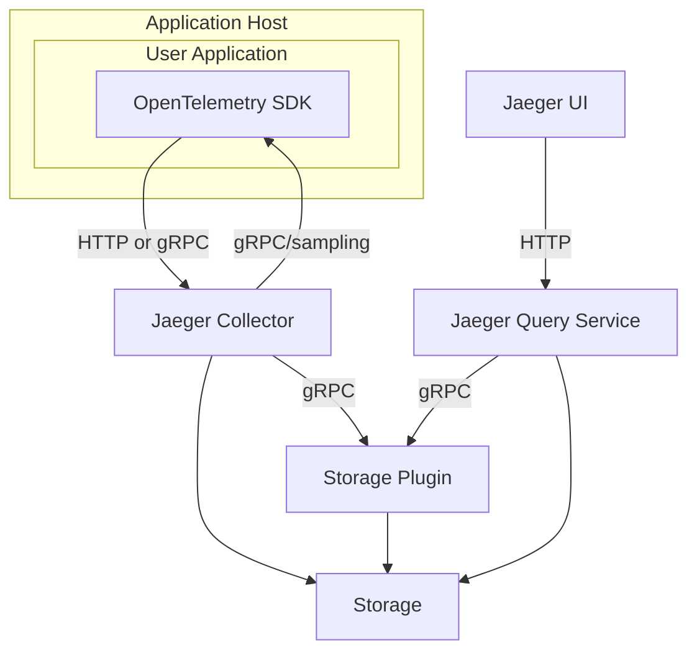

# jaeger

## 项目简介
[](https://stand-with-ukraine.pp.ua)


[![Slack chat][slack-img]](#get-in-touch)
[![Unit Tests][ci-img]][ci]
[![Coverage Status][cov-img]][cov]
[![Project+Community stats][community-badge]][community-stats]
[![FOSSA Status][fossa-img]][fossa]
[![OpenSSF Scorecard][openssf-img]][openssf]
[![OpenSSF Best Practices][openssf-bp-img]][openssf-bp] 
[![CLOMonitor][clomonitor-img]][clomonitor]
[![Artifact Hub][artifacthub-img]][artifacthub]


# Jaeger - a Distributed Tracing System

💥💥💥 Jaeger v2 is out! Read the [blog post](https://medium.com/jaegertracing/jaeger-v2-released-09a6033d1b10) and [try it out](https://www.jaegertracing.io/docs/latest/getting-started/).

## Quick Start

Get Jaeger running in seconds with Docker:

```bash
# Run Jaeger all-in-one (includes UI, collector, query, and in-memory storage)
docker run --rm --name jaeger \
  -p 16686:16686 \
  -p 4317:4317 \
  -p 4318:4318 \
  jaegertracing/jaeger:latest

# Access the UI at http://localhost:16686
# Send traces via OTLP: gRPC on port 4317, HTTP on port 4318
```

For production deployments and more options, see the [Getting Started Guide](https://www.jaegertracing.io/docs/latest/getting-started/).

## Architecture

## 整体架构描述
## Architecture



Jaeger is a distributed tracing platform created by [Uber Technologies](https://eng.uber.com/distributed-tracing/) and donated to [Cloud Native Computing Foundation](https://cncf.io).

See Jaeger [documentation][doc] for getting started, operational details, and other information.

Jaeger is hosted by the [Cloud Native Computing Foundation](https://cncf.io) (CNCF) as the 7th top-level project, graduated in October 2019. See the CNCF [Jaeger incubation announcement](https://www.cncf.io/blog/2017/09/13/cncf-hosts-jaeger/) and [Jaeger graduation announcement](https://www.cncf.io/announcement/2019/10/31/cloud-native-computing-foundation-announces-jaeger-graduation/).

## Get Involved

Jaeger is an open source project with open governance. We welcome contributions from the community, and we would love your help to improve and extend the project. Here are [some ideas](https://www.jaegertracing.io/get-involved/) for how to get involved. Many of them do not even require any coding.

## Version Compatibility Guarantees

## 核心模块划分
Since Jaeger uses many components from the [OpenTelemetry Collector](https://github.com/open-telemetry/opentelemetry-collector/) we try to maintain configuration compatibility between Jaeger releases. Occasionally, configuration options in Jaeger (or in Jaeger v1 CLI flags) can be deprecated due to usability improvements, new functionality, or changes in our dependencies.
In such situations, developers introducing the deprecation are required to follow [these guidelines](./CONTRIBUTING.md#deprecating-cli-flags).

In short, for a deprecated configuration option, you should expect to see the following message in the documentation or release notes:
```
(deprecated, will be removed after yyyy-mm-dd or in release vX.Y.Z, whichever is later)
```

A grace period of at least **3 months** or **two minor version bumps** (whichever is later) from the first release
containing the deprecation notice will be provided before the deprecated configuration option _can_ be deleted.

For example, consider a scenario where v2.0.0 is released on 01-Sep-2024 containing a deprecation notice for a configuration option.
This configuration option will remain in a deprecated state until the later of 01-Dec-2024 or v2.2.0 where it _can_ be removed on or after either of those events.
It may remain deprecated for longer than the aforementioned grace period.

## Go Version Compatibility Guarantees

The Jaeger project attempts to track the currently supported versions of Go, as [defined by the Go team](https://go.dev/doc/devel/release#policy).
Removing support for an unsupported Go version is not considered a breaking change.

Starting with the release of Go 1.21, support for Go versions will be updated as follows:
--
### Components

 * [UI](https://github.com/jaegertracing/jaeger-ui)

## 技术选型
- 构建工具: 未知
- 主要语言: Java

## 与PRD的对应关系
参见项目官方文档
